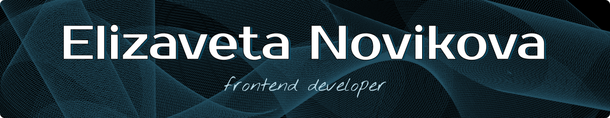

  
  
  

---

  

    Hello, everyone! Here, you can get to know me a bit better.
  

  

    The foundation of my current knowledge in web development was laid during my tenure in the <a href="https://rs.school/">Rolling Scopes School</a> program (<a href="https://rs.school/js-stage0/">JavaScript/Front-end. Stage 0</a>, <a href="https://rs.school/js/">JavaScript/Front-end</a>, <a href="https://rs.school/react/">React Course</a>). This comprehensive curriculum equipped me with proficiency in a wide range of skills.
  

  

    When engaged in educational projects, I've developed a keen eye for detail. Whether it's adding subtle animations or enhancing user experience through hover effects, I take pride in crafting applications that are not just functional but delightful to use. What I find most rewarding in front-end development is the immediate feedback loop – the ability to witness the results of my work in real time.
  

---

    
    
    
    
    
    
    
    
    
    
    
    
    
    
    
    

 

<table align="center" style="overflow: hidden; border-radius: 5px;">
  <tr>
    <td style="border: 4px solid #D6D6D6">
      
    </td>
    <td style="border: 4px solid #D6D6D6">
      
    </td>
  </tr>
</table>

 

  

 

